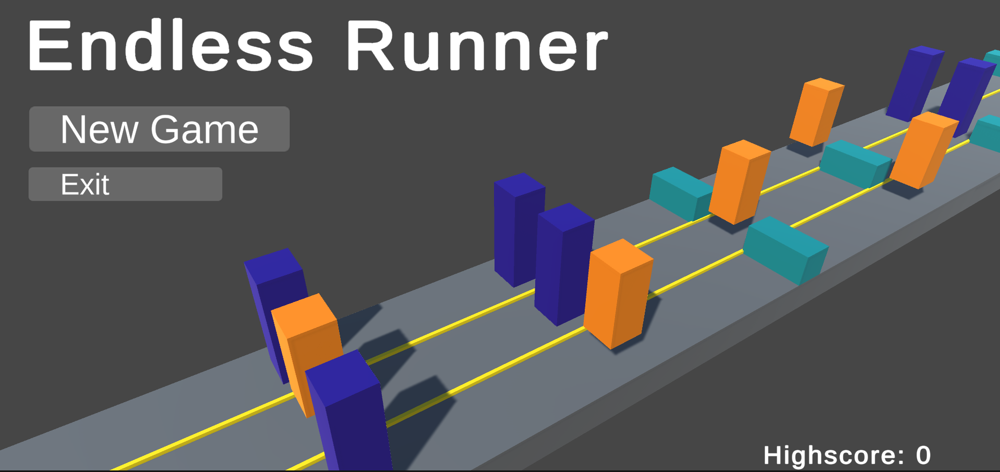
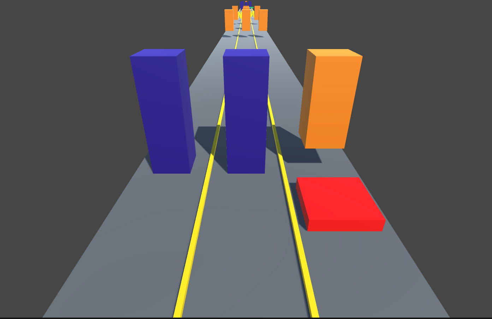

# EndlessRunner
## Arcade game developed in Unity featuring an endless runner with various obstacles.
Endless Runner Arcade Game is an Unity-developed arcade game featuring an endless running experience. Objective is to navigate through a continuously generated course, dodge various obstacles, and achieve the highest score. With simple controls and increasingly difficult gameplay, it’s perfect for quick, engaging play sessions.
## Source folder
Most of my code is stored in [Scripts](Assets/Scripts) folder
## Screenshots

